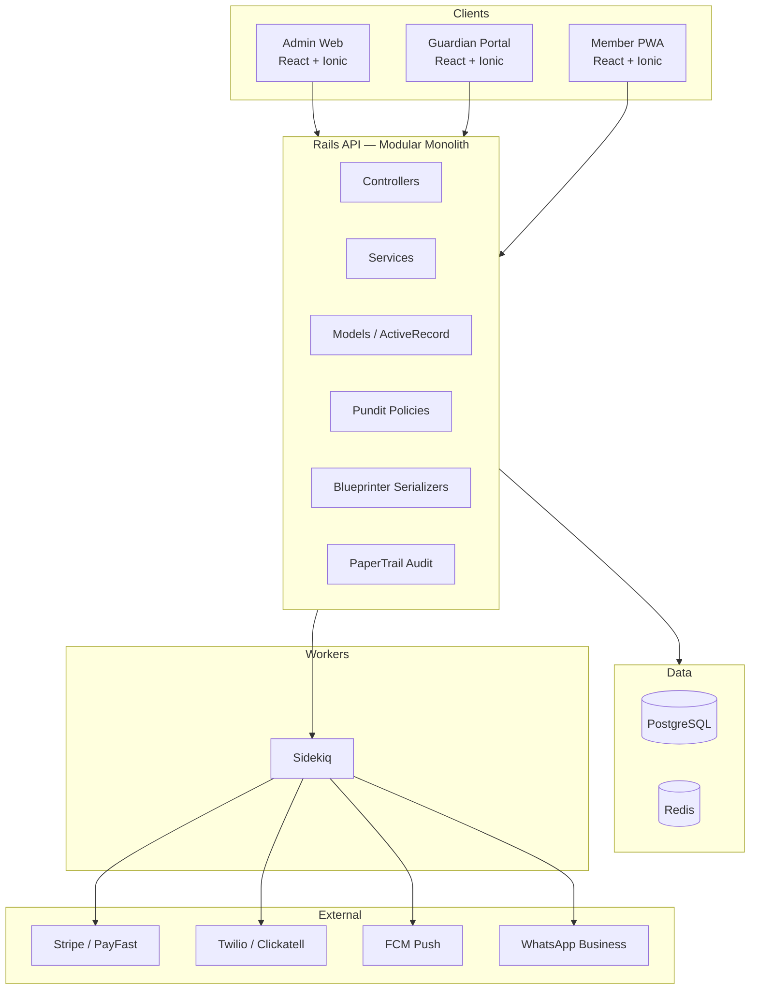

# MMA Club Management System

## design
- **Palette:** deep red (`#8B1E1E` / `#A32626`), charcoal (`#1A1A1A` / `#232323`), marble accents (`#EDEAE5` warm off-white with subtle veining), muted gold for highlights (`#B8894A`)
- **Typography:** Display — `Bebas Neue` or `Anton` for headers (uppercase, tight tracking). UI — `Inter` for body, `JetBrains Mono` for numbers/data.

## Table of Contents

- [[#1. Architecture]]
- [[#2. Tech Stack]]
- [[#3. Data Model]]
- [[#4. ERD Diagram]]
- [[#5. Permission Matrix]]
- [[#6. Subsystems & Build Order]]
- [[#7. Figma Structure]]
- [[#8. Repo Structure]]
- [[#9. Open Questions]]

## 1. Architecture
Modular monolith. Rails API + React/Ionic clients. Postgres + Redis + Sidekiq.



## 2. Tech Stack
### Frontend

| Concern | Choice | Why |
|---|---|---|
| Framework | React 18 + TypeScript | - |
| Build | Vite | Fast, modern, no CRA |
| UI Kit | Ionic React | - |
| Styling | Tailwind + Ionic CSS vars | - |
| Server state | TanStack Query | Caching, invalidation, optimistic UI |
| Local state | Zustand | Lightweight, no Redux ceremony |
| Forms | React Hook Form + Zod | - |
| Motion | Framer Motion | - |
| Icons | Hugeicons | - |

### Backend
| Concern | Choice | Why |
|---|---|---|
| Framework | Ruby on Rails 7 (API mode) | Opinionated, fast to ship, ActiveRecord handles relational |
| Language | Ruby 3.3+ | - |
| DB | PostgreSQL 16 | JSONB, row-level security, solid |

### Infra
- **Docker + Docker Compose** — local dev
- **GitHub Actions** — CI
- **Fly.io / Hetzner + Kamal** — production
- **Sentry + Logtail** — monitoring

---

### Steps

```bash
# 1. Clone
git clone <repo-url> mma-club
cd mma-club

# 2. Copy env file
cp .env.example .env
# edit .env and fill in RAILS_MASTER_KEY + JWT_SECRET (see Environment Variables)

# 3. Build containers
make build
# or: docker compose build

# 4. Start everything
make up
# or: docker compose up -d

# 5. Set up the database (first time only)
docker compose exec api bundle exec rails db:setup

# 6. Verify
docker compose ps
```

| Service | URL |
|---|---|
| frontend (Vite) | http://localhost:5173 |
| API | http://localhost:3000 |
| API health | http://localhost:3000/up |
| Postgres | `localhost:5432` |
| Redis | `localhost:6379` |

### Stopping

```bash
make down          # stop containers, keep data
make reset         # nuke everything (containers + volumes + rebuild)
```

---

### Prerequisites

- **Ruby 3.3.4** (rbenv or asdf)
- **Node 20+** (nvm or fnm)
- **PostgreSQL 16**
- **Redis 7**


### Setup

```bash
# API
cd api
bundle install
cp ../.env.example .env
# edit .env: point DATABASE_URL and REDIS_URL at localhost
bin/rails db:setup
bin/rails server

# Sidekiq (new terminal)
cd api
bundle exec sidekiq -C config/sidekiq.yml

# Web (new terminal)
cd frontend
npm install
npm run dev
```

**Getting a JWT secret:**
```bash
openssl rand -hex 64
```