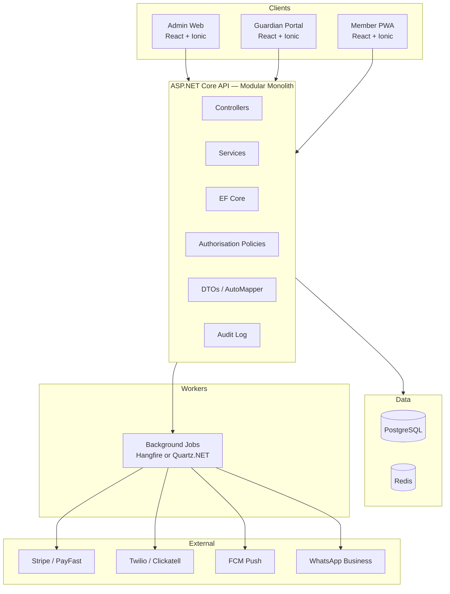

# MMA Club Management System

## Design

- **Palette:** deep red (`#8B1E1E` / `#A32626`), charcoal (`#1A1A1A` / `#232323`), marble accents (`#EDEAE5` warm off-white with subtle veining), muted gold for highlights (`#B8894A`)
- **Typography:** Display — `Bebas Neue` or `Anton` for headers (uppercase, tight tracking). UI — `Inter` for body, `JetBrains Mono` for numbers/data.

## Table of Contents

- [[#1. Architecture]]
- [[#2. Tech Stack]]
- [[#3. Data Model]]
- [[#4. Permission Matrix]]
- [[#5. Subsystems & Build Order]]
- [[#6. Repo Structure]]
- [[#7. Getting Started]]
- [[#8. Open Questions]]

---

## 1. Architecture

Modular monolith. ASP.NET Core API + React/Ionic clients. Postgres for data, Redis for cache and background jobs.


```mermaid
flowchart TB
    subgraph Clients
        A[Admin Web<br/>React + Ionic]
        B[Guardian Portal<br/>React + Ionic]
        C[Member PWA<br/>React + Ionic]
    end

    subgraph API[ASP.NET Core API — Modular Monolith]
        D[Controllers]
        E[Services]
        F[EF Core]
        G[Authorisation Policies]
        H[DTOs / AutoMapper]
        I[Audit Log]
    end

    subgraph Data
        J[(PostgreSQL)]
        K[(Redis)]
    end

    subgraph Workers
        L[Background Jobs<br/>Hangfire or Quartz.NET]
    end

    subgraph External
        M[Stripe / PayFast]
        N[Twilio / Clickatell]
        O[FCM Push]
        P[WhatsApp Business]
    end

    A --> API
    B --> API
    C --> API
    API --> Data
    API --> L
    L --> M
    L --> N
    L --> O
    L --> P
```

**Principles**

- Thin controllers → services for anything multi-step
- One authorisation policy per resource — critical for minor data access
- Audit logging on every model that touches a minor
- API versioned at `/api/v1/`
- Background everything async (emails, SMS, reports, reminders)

---

## 2. Tech Stack

### Frontend

| Concern | Choice | Why |
|---|---|---|
| Framework | React 18 + TypeScript | Type safety across ~25 entities |
| Build | Vite | Fast, modern, no CRA |
| UI Kit | Ionic React | Forms, modals, gestures, theming |
| Styling | Tailwind + Ionic CSS vars | Layout control alongside Ionic tokens |
| Server state | TanStack Query | Caching, invalidation, optimistic UI |
| Local state | Zustand | Lightweight, no Redux ceremony |
| Forms | React Hook Form + Zod | Lots of forms, need validation |
| Motion | Framer Motion | Subtle elegance |
| Icons | Hugeicons | Clean, consistent |

### Backend

| Concern | Choice | Why |
|---|---|---|
| Framework | ASP.NET Core 8 (Web API) | Runs natively on macOS 27, mature, fast |
| Language | C# 12 | Statically typed, great tooling |
| ORM | EF Core 8 + Npgsql | Migrations, LINQ, Postgres-native |
| DB | PostgreSQL 16 | JSONB, row-level security, solid |
| Cache / Queue | Redis 7 | Sessions, cache, background jobs |
| Background jobs | Hangfire | Rails-Sidekiq equivalent for .NET |
| Auth | Cookie authentication | `HttpOnly`, `SameSite`, server-side sessions |
| Email (dev) | Mailpit | Catches all outgoing mail locally |
| Email (prod) | MailKit + SMTP or SendGrid | |
| Serialisation | System.Text.Json | Built-in, fast |
| Validation | FluentValidation | Form and request validation |
| Logging | Serilog | Structured logs |

### Infra

- **Docker + Docker Compose** — local dev for Postgres, Redis, Mailpit
- **GitHub Actions** — CI
- **Fly.io / Hetzner** — production
- **Sentry** — error monitoring

---

## 3. Data Model

Full model lives in `docs/MMA Club Management System.md`. High-level entity groups:

- **Identity** — Person, User, GuardianLink, EmergencyContact
- **Consent & compliance** — ConsentDocument, ConsentSignature
- **Membership** — MembershipPlan, Membership, MembershipFreeze, Attendance
- **Payments** — Invoice, Payment, PaymentMethod
- **Schedule & fighting** — Session, SessionEnrollment, Event, Bout
- **Notifications** — NotificationTemplate, Notification
- **Inventory** — InventoryItem, StockMovement, Sale
- **Audit** — AuditLog

See the vault for the full ERD.

---

## 4. Permission Matrix

| Resource | Admin | Staff/Coach | Safeguarding Officer | Guardian | Adult Member | Minor Member |
|---|---|---|---|---|---|---|
| Person (own) | RW | R | R | R | RW | R (limited) |
| Person (minor) | RW | R (limited) | RW | RW (own minors) | — | — |
| Medical / consent | RW | — | RW | RW (own minors) | RW (own) | — |
| Membership | RW | R | R | RW (own minors) | RW (own) | — |
| Invoice / Payment | RW | — | — | RW (own minors) | RW (own) | — |
| Session | RW | RW (own) | R | R | R | R |
| Bout | RW | RW | R | R | R | R |
| Inventory | RW | R | — | — | — | — |
| Audit log | RW | — | R | — | — | — |
| Notifications | RW | R (own sessions) | RW | R (own) | R (own) | R (own) |

**Hard rules:**

- Only admin + safeguarding_officer can access minor medical/consent records
- Staff sees only attendance + schedule for minors, no contact details
- All comms to minors route to primary guardian
- Every access to minor data logged
- Minors never see payments or other members' data

---

## 5. Subsystems & Build Order

> Do not skip ahead. Each phase ships a usable slice.

### Phase 0 — Design Foundation ✅
- Figma design system, key screens, Dribbble inspiration
- Component library in code

### Phase 1 — Auth & Foundation ⏳ *in progress*
- [x] ASP.NET Core project scaffold (API mode)
- [x] Postgres + Redis + Mailpit via Docker
- [ ] Cookie authentication + session model
- [ ] OTP request + verify endpoints
- [ ] Person, User, GuardianLink models
- [ ] Role system + authorisation policies
- [ ] Audit logging
- [ ] Frontend auth flow wired to real API

### Phase 2 — Consent & Compliance
- ConsentDocument + ConsentSignature
- Waiver templates (liability, medical, photo, data, emergency)
- Signing flow (guardian signs for minor)
- Versioning + revocation

### Phase 3 — Membership
- MembershipPlan CRUD
- Membership lifecycle (pending → active → frozen → cancelled → expired)
- Age-gated plan assignment
- Attendance

### Phase 4 — Payments
- Invoice generation
- Payment recording + gateway integration (Stripe / PayFast)
- Guardian billing (minors billed to guardian)
- Overdue detection + reminders

### Phase 5 — Schedule & Sessions
- Session CRUD with recurrence
- SessionEnrollment (booking, attendance)
- Age-gated enrollment (minor can't join adult-only)
- Coach assignment

### Phase 6 — Events & Fighting
- Event CRUD
- Bout scheduling
- Age-bracket enforcement for minors
- Results recording

### Phase 7 — Notifications
- NotificationTemplate CRUD
- Channel adapters (email, SMS, push, WhatsApp)
- Routing rules (guardian for minors)
- Reminder schedules

### Phase 8 — Inventory
- InventoryItem CRUD
- StockMovement tracking
- Sales + POS-lite

### Phase 9 — Dashboards & Reports
- Admin, guardian, member dashboards
- Exportable reports

### Phase 10 — Polish & Safeguarding
- Audit log UI
- Data export / deletion (POPIA)
- Safeguarding officer views
- Penetration test

---

## 6. Repo Structure

```
mma-club/
├── backend/                    # ASP.NET Core API
│   ├── Controllers/
│   ├── Services/
│   ├── Data/
│   │   └── AppDbContext.cs
│   ├── Models/
│   ├── DTOs/
│   ├── Validators/
│   ├── Migrations/
│   ├── Program.cs
│   ├── GymManagement.csproj
│   ├── appsettings.json
│   ├── appsettings.Development.json
│   └── Dockerfile.dev
├── frontend/                   # React + Vite + Ionic
│   ├── src/
│   │   ├── api/
│   │   ├── components/
│   │   ├── features/
│   │   ├── lib/
│   │   ├── pages/
│   │   ├── routes/
│   │   ├── theme/
│   │   └── types/
│   ├── public/
│   ├── package.json
│   ├── vite.config.ts
│   └── Dockerfile.dev
├── docs/                       # Obsidian vault — source of truth
├── docker-compose.yml
├── CHANGELOG.md
├── Makefile
└── README.md
```

---

## 7. Getting Started

### Prerequisites

- **.NET SDK 8+** — `brew install --cask dotnet-sdk` ([install guide](https://dotnet.microsoft.com/download))
- **Node 20+** — `nvm install 20` or `fnm install 20`
- **Docker Desktop** — for Postgres, Redis, Mailpit
- **VS Code** with the **C# Dev Kit** extension

> **macOS 26 / 27 users:** Do not install Ruby or Rails locally. macOS 26+ has a
> known OS-level bug that breaks Ruby's pre-forking worker model, which
> crashes Puma and any Rails app at boot. It also affects macOS 27 (Golden
> Gate). The backend for this project is .NET, which runs natively. If you
> were planning to use Rails, run it inside Docker only.

### First-time setup

```bash
# 1. Clone
git clone git@github.com:AnaPule/Gym-management.git mma-club
cd mma-club

# 2. Copy env template
cp .env.example .env

# 3. Start infrastructure (Postgres, Redis, Mailpit)
docker compose up -d db redis mailpit

# 4. Install backend dependencies
cd backend
dotnet restore

# 5. Apply migrations
dotnet ef database update

# 6. Run the API
dotnet run
# API: http://localhost:5000

# 7. Frontend (new terminal)
cd frontend
npm install
npm run dev
# Web: http://localhost:5173
```

### Service URLs

| Service | URL |
|---|---|
| Frontend (Vite) | http://localhost:5173 |
| API | http://localhost:5000 |
| API health | http://localhost:5000/health |
| Mailpit (dev inbox) | http://localhost:8025 |
| Postgres | `localhost:5432` |
| Redis | `localhost:6379` |

### Stopping

```bash
make down          # stop containers, keep data
make reset         # nuke containers + volumes, rebuild
```

### Running everything in Docker

Once you want full container parity with production:

```bash
docker compose up --build
```

This builds the backend container, starts Postgres, Redis, Mailpit, and
the frontend. All the .NET tooling runs inside a Linux container — no
host SDK required.

---

## 8. Open Questions

- [ ] Confirm "morbal combat" = **marble** aesthetic? (assumed yes)
- [ ] Exact accent red — `#8B1E1E` ok, or pull from an existing logo?
- [ ] Do minors get their own login, or guardian-only until 16?
- [ ] Age of majority = 18 (SA default)? Any younger brackets for classes (u10/u14/u18)?
- [ ] Payment gateway: Stripe, PayFast, Yoco, or manual EFT?
- [ ] WhatsApp Business API — do you want it in v1?
- [ ] Do you need in-app document signing (canvas signature) or record-only?
- [ ] POPIA Information Officer registered? (required if processing minors' data)
- [ ] Hosting preference — Fly.io, Hetzner, Render?
- [ ] Domain name?

---

## Changelog

See [CHANGELOG.md](./CHANGELOG.md). One entry per coding session, grouped
by date. Update on every meaningful change.

---

## Contributing

See [docs/CONTRIBUTING.md](./docs/CONTRIBUTING.md) for author tags,
changelog policy, branch naming, commit style, code style, tests, and PR
checklist.

---

<!--
Author: Ana Pule
Repo:   https://github.com/AnaPule/Gym-management
-->